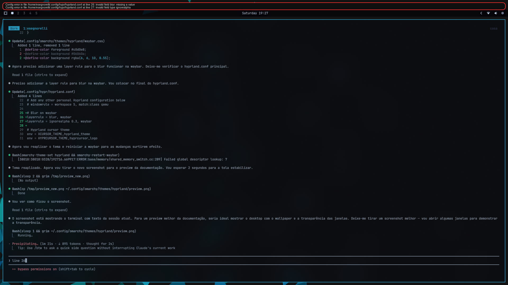

# Hyprland Theme for Omarchy

A dark theme inspired by Hyprland's iconic cyan and teal color palette, with full integration of all native Hyprland visual effects.

Built around the signature border gradient colors (`#33ccff` cyan and `#00ff99` green) that define Hyprland's visual identity, paired with a deep dark background.

## Preview



## Colors

| Element | Color |
|---------|-------|
| Accent | `#33ccff` |
| Background | `#0a0b10` |
| Foreground | `#c0d0e8` |
| Green | `#00ff99` |
| Cyan | `#00e4cc` |
| Red | `#ff6e8a` |
| Yellow | `#ffcc66` |
| Magenta | `#b48ead` |

## Hyprland Effects

This theme goes beyond colors — it integrates all native Hyprland visual features:

| Effect | Details |
|--------|---------|
| Blur | Kawase blur, 8px size, 3 passes with vibrancy |
| Transparency | Active 70%, inactive 45%, fullscreen 90% |
| Shadows | Drop shadow range 20, render power 3, offset (0, 4) |
| Rounded corners | 10px rounding |
| Gradient borders | Cyan to green at 45deg, animated loop |
| Dim inactive | 15% dimming on unfocused windows |
| Animations | Custom bezier curves: popin, slidefade, border loop |
| Groupbar | Blur + gradients with theme colors |
| Waybar | Semi-transparent background with blur |
| Walker | Semi-transparent background with blur + slide animation |

## What's Included

| File | Purpose |
|------|---------|
| `colors.toml` | Full 16-color palette based on Hyprland branding |
| `hyprland.conf` | Borders, transparency, blur, shadows, animations |
| `btop.theme` | Custom btop system monitor theme |
| `neovim.lua` | Neovim colorscheme configuration |
| `vscode.json` | VS Code theme mapping |
| `waybar.css` | Waybar with transparency for blur |
| `walker.css` | Walker launcher with transparency for blur |
| `icons.theme` | Yaru-prussiangreen-dark icon theme |
| `keyboard.rgb` | Keyboard RGB color (`33ccff`) |
| `backgrounds/` | 4 wallpapers from the Hyprland community |

## Installation

```bash
omarchy-theme-install https://github.com/Esegnorelli/omarchy-hyprland-theme.git
```

All effects (blur, layerrules, cursor, animations) are applied automatically — no manual configuration needed.

## Wallpapers

| File | Description |
|------|-------------|
| `1-hypr-droplet.png` | Hyprland droplet logo with wave patterns |
| `2-cyan-shards.png` | Cyan crystal shards on dark background |
| `3-orbit-rings.png` | Minimalist orbit rings with color gradient |
| `4-hyprland-bsod.png` | Hyprland BSOD easter egg |
